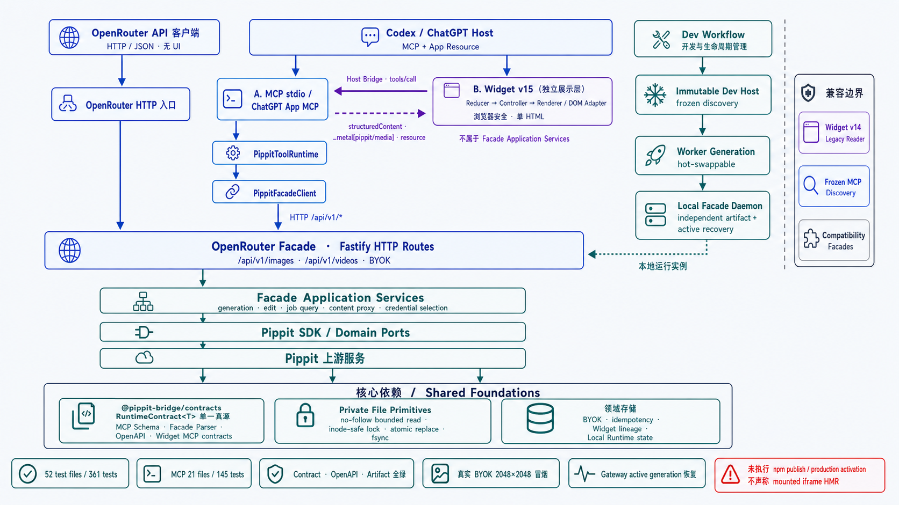

# Pippit Bridge 架构

> 本文描述 `feat/architecture-refactor-20260721` 完成后的代码架构、运行时调用链和必须长期保持的边界。
> 分阶段实施记录、契约 hash 与逐项验收证据见
> [重构技术方案与工作项](./refactoring-architecture-plan.md)。Codex Dev/发布工程细节见
> [Codex Plugin 开发热更新与正式发布工程](./codex-plugin-dev-release-engineering.md)。

## 1. 架构定位

Pippit Bridge 是面向单个本地用户的 API gateway 与 adapter monorepo。它把同一组 Pippit
图片、视频和账号能力投影到不同入口，但不把这些入口错误地合并成一种协议或一种产品形态：

- OpenRouter Facade 是纯 HTTP/JSON API，没有 UI。
- 通用 MCP、Codex plugin 与 ChatGPT App 通过 MCP tool/resource contract 接入。
- Widget v15 是由 Codex/ChatGPT Host 挂载的浏览器展示层，不是 Facade Application Service。
- OpenCode plugin 是独立 custom-tool adapter，直接使用 Core/SDK，不伪装成语言模型 provider。
- Dev Host、Worker Generation 与 Local Facade Daemon 是构建和生命周期平面，不是业务分层。

当前产品边界是 single-user、local-first、single-writer。私有用户文件、loopback daemon、进程内
或本地文件锁都是有意设计。多用户 OAuth、租户隔离、分布式锁、横向扩容、共享远程数据库和跨机器
状态同步不属于当前架构目标。

## 2. 总体架构



图中展示 Facade、MCP、Codex/ChatGPT Widget 与 Dev 三平面的主路径。OpenCode custom-tool plugin
不经过 Facade，作为独立 adapter 在[第 9 节](#9-opencode-独立适配器)说明。

架构必须保持入口在上、核心依赖在下。两条主要运行时路径最终汇入同一个 HTTP Facade：

```text
OpenRouter API client
  -> OpenRouter HTTP entry
  -> OpenRouter Facade / Fastify routes
  -> Facade application services
  -> Pippit SDK / domain ports
  -> Pippit upstream

Codex / ChatGPT Host
  -> MCP stdio or ChatGPT App MCP
  -> PippitToolRuntime
  -> PippitFacadeClient
  -> HTTP /api/v1/*
  -> the same OpenRouter Facade / Fastify routes
  -> the same application services and SDK path
```

这意味着 MCP 不直接 import Facade business handler；即使使用自动启动的本地 Facade daemon，工具调用
仍经过认证的 HTTP contract。外部部署 Facade 与本地 loopback Facade 因而共享同一运行时语义。

## 3. Workspace 与依赖方向

```text
packages/contracts
  -> runtime contracts and JSON Schema projection

packages/core
  -> private-file primitives, idempotency, reference loading, release epoch

packages/sdk
  -> Pippit upstream upload / submit / query client

apps/openrouter-facade
  -> Fastify routes, application services, BYOK, OpenAPI
  -> depends on contracts + core + sdk

packages/mcp-server-pippit
  -> MCP protocol, tools, Facade client, Widget, local runtime, Codex plugin
  -> runtime depends on contracts + core
  -> bundles the Facade daemon as an explicit build-time artifact

apps/chatgpt-app
  -> Streamable HTTP MCP, safe tool projection, Widget resources, signed media proxy
  -> reuses the MCP package runtime and Widget contracts

packages/opencode-plugin-pippit
  -> OpenCode custom tools and account store
  -> direct Core/SDK adapter; no Facade runtime dependency
```

核心规则：

1. `contracts` 不依赖任何 consumer package。
2. `core` 和 `sdk` 不依赖 MCP、Fastify、Widget 或 OpenCode adapter。
3. HTTP routes 只负责 transport/auth/parsing/presentation，不直接访问 SDK、文件系统或具体 store。
4. Facade application services 不依赖 `FastifyRequest` 或 `FastifyReply`。
5. Widget browser source 不 import `node:*`。
6. MCP daemon 不通过相对路径穿透到 `apps/openrouter-facade/src`。
7. Dev Host source 不进入 Worker artifact；Worker 不能修改 Host frozen discovery。

`npm run check:architecture` 对上述关键 forbidden imports、compatibility facade、模块体积、循环依赖和
artifact external 边界执行自动检查。

## 4. OpenRouter Facade

OpenRouter Facade 是唯一的业务 HTTP 边界。`buildApp()` 负责 composition：构造配置、BYOK store、
reference loader、Pippit SDK client 和各 application service，再把它们注入 routes。

```text
apps/openrouter-facade/src/
  app.ts                         compatibility entry
  app/composition.ts             dependency composition
  app/register-routes.ts         route assembly
  app/route-contracts.ts         method/path/auth/body/cache contract
  app/routes/                    Fastify adapters
  app/services/                  application use cases
  app/presenters/                response projection
  byok/                          encrypted credential domain
  openapi/                       OpenAPI document projection
```

典型图片调用链：

```text
POST /api/v1/images
  -> route contract parser
  -> runtime authentication
  -> registerImageRoutes adapter
  -> createImageGenerationService
  -> BYOK credential selection
  -> reference load/upload
  -> PippitApi.submitRun/queryVideoResult
  -> OpenRouter-compatible response
```

Route contract 同时约束 Fastify 注册、输入解析、auth、cache policy 和 OpenAPI path。Service 接收普通
DTO、domain ports 与 `AbortSignal`，不知道 Fastify 的存在。SDK 是 Facade service 到 Pippit upstream 的
边界；MCP 和 Widget 都不能越过 Facade 直接调用它。

## 5. MCP、Codex Plugin 与 ChatGPT App

### 5.1 MCP 工具路径

通用 stdio MCP 与 Codex plugin 使用同一 `PippitToolRuntime`。ChatGPT App 对同一个 runtime 做安全投影，
增加 Streamable HTTP transport、Apps metadata 和上传字段，但不复制业务 handler。

```text
MCP initialize/tools/list/resources/list
  -> frozen discovery, no Facade startup

first tools/call
  -> lazy runtime initialization
  -> resolve external Facade or ensure local Facade daemon
  -> PippitToolRuntime input parsing and result mapping
  -> PippitFacadeClient
  -> authenticated HTTP /api/v1/*
```

本地模式只在第一次实际 tool call 时创建或复用用户级 loopback Facade；安装、`initialize` 和
`tools/list` 不启动 daemon，也不创建密钥。若显式配置外部 Facade，base URL 与 runtime API key 必须
成对存在，半套配置 fail closed。

Runtime 与 Management client 是不同 capability：前者只调用模型、生成、查询和内容路由；后者只调用
BYOK 管理路由。Pippit AK 只能通过一次性 loopback password form 写入加密 store，不进入普通 tool
arguments、Widget、日志或聊天上下文。

### 5.2 Codex plugin

Codex plugin 是 MCP package 内的分发与宿主声明层：

- `.codex-plugin/plugin.json`、`.mcp.json` 和 Skill 属于 immutable cold contract。
- launcher 启动同一个 stdio MCP server，不维护另一份业务协议。
- Skills 由 Codex Host 扫描，MCP gateway 不管理也不热更新 Skills。
- Production identity `pippit-video@pippit-bridge` 与 Dev identity
  `pippit-video@pippit-bridge-dev` 必须使用物理隔离的 profile、cache、runtime root 和 credentials。

### 5.3 ChatGPT App

ChatGPT App 注册 Streamable HTTP `/mcp`、安全的 MCP tools、Widget resources 和可选的 signed media
proxy。它复用 MCP tool runtime，但不投影 Management-Key-backed account tools。当前 `noauth`
配置只适用于本地或受控 tunnel 的 developer-mode；公共多用户部署仍需要真实 App ID、OAuth、远程
secret manager、per-user mapping 与远程持久化。

## 6. Widget v15：独立展示层

Widget v15 与 OpenRouter API 无关。OpenRouter HTTP caller 只得到 JSON；只有支持 MCP Apps 的 Host
才会根据 tool metadata 中的 `ui.resourceUri` / `openai/outputTemplate` 挂载 Widget resource。

```text
Host
  -> resources/read ui://widget/pippit-video-job-v15.html
  -> mount dependency-free HTML
  -> deliver structuredContent + _meta["pippit/media"]

Widget user action
  -> Host Bridge tools/call
  -> MCP runtime
  -> PippitToolRuntime
  -> PippitFacadeClient
  -> Facade HTTP
```

浏览器内部边界：

- Reducer 只执行 `WidgetState + Event -> WidgetState + Effect`，不访问 DOM、Timer、Promise 或 Blob URL。
- Controller 执行 polling、tool call、preview renewal、state persistence 和 display mode。
- Renderer 只执行 `state -> DOM`，不解析 MCP result，也不发起工具调用。
- Preview loader 独占 `AbortSignal`、Blob URL 和清理责任。
- 每个异步结果携带 generation/preview identity；过期响应被统一拒绝。
- Widget 只消费服务端投影的 `structuredContent` 和 `_meta["pippit/media"]`，不处理私有 upstream URL。

Typed browser-safe modules 经 deterministic assembly 生成单一、无外部依赖的
`assets/generated/pippit-video-job-v15.html`。Widget URI、MIME、CSP、tool binding、schema、默认值和
结果语义都是 cold contract。v14 只作为 legacy reader 保留。当前没有把 dev Widget primitives 接入已
挂载 iframe，因此 Widget source 变化仍需 cold rebuild 和新 Widget instance；不得声称 mounted iframe HMR。

## 7. Contracts 与 OpenAPI 单一真源

`@pippit-bridge/contracts` 提供 Zod-backed `RuntimeContract<T>`：

```ts
interface RuntimeContract<T> {
  readonly schema: z.ZodType<T>
  parse(value: unknown): T
  toJsonSchema(): JsonSchema
}
```

同一 runtime contract 投影到：

- MCP input/output JSON Schema；
- Facade request/response parser；
- OpenAPI components/path request body；
- Widget MCP helper tool contracts；
- TypeScript DTO。

单一真源不代表把所有 surface 合成同一种 shape。MCP 顶层 `byok_id`、`thread_id` 和
`idempotency_key`，Facade 的 `provider.options.pippit`，仅允许 HTTP(S) 的引用 URL，以及允许特定
data URL 的图片输入继续是不同 contract。projection 必须共享 primitive 和语义，但保留 surface-specific
mapping。

UUID、min/max、default、description、schema 或结果含义的变化都按 cold contract 审阅。Golden 只能记录
已批准的显式变更，不能用于掩盖行为回归。

## 8. Private-file 与领域存储

`packages/core/src/private-file/` 只统一文件安全机制，不拥有 BYOK、account、idempotency、Widget lineage
或 Local Runtime 的领域 schema。

共享机制包括：

- 私有目录与文件 owner/mode 检查；
- bounded no-follow read；
- `O_NOFOLLOW | O_EXCL` 创建；
- `dev/ino` 二次验证和 inode-safe stale-lock recovery；
- temporary-file `fsync`、atomic rename 与 parent-directory `fsync`；
- rename 已发生但 directory `fsync` 失败时返回 `DURABILITY_UNCERTAIN`；
- release/remove 前重新验证 inode owner，避免删除后来者文件；
- secret buffer 使用后清零。

领域策略保持独立：

| Store | 领域责任 | 不能被共享机制替代的策略 |
| --- | --- | --- |
| Facade BYOK | 加密 AK、选择、rotation | AES-256-GCM、AAD、key version、lifetime lock |
| OpenCode account | 本地账号与 active pointer | managed-account binding、plaintext same-UID boundary |
| MCP idempotency | 异常恢复 ledger | submitting/submitted/indeterminate 状态机 |
| Widget lineage | source/child job 链 | Facade identity scope、append-only records |
| Local Runtime | secrets、ready proof、daemon state | HMAC proof、runtime version、bootstrap lock |

不得为了复用机制而合并这些文件格式、storage path、encryption envelope 或 migration epoch。

## 9. OpenCode 独立适配器

OpenCode 的 provider contract 是语言模型协议，而 Pippit 提供图片/异步视频任务。OpenCode package 因而
只注册 custom tools，不增加 `config.provider.pippit`，也不返回 `auth`/`provider` hook。

```text
OpenCode agent
  -> @pippit-bridge/opencode-plugin
  -> permission-gated custom tool
  -> Core reference loader / idempotency
  -> Pippit SDK
  -> Pippit upstream
```

这条路径不经过 Facade API Key、Management API Key、Facade BYOK store 或 signed Facade job token。
OpenCode account store 与 Facade BYOK store 是两个不同的安全域；它们只复用 private-file 机制和必要的
模型/SDK contract。

## 10. Dev 三平面与产物身份

Dev loop 按生命周期拆成三个独立平面：

| 平面 | 冻结或负责的内容 | 变化后的处理 |
| --- | --- | --- |
| Immutable Dev Host | initialize、discovery、manifest、Skills、static Widget resource、stable IPC | 要求 Host rebootstrap |
| Worker Generation | `tools/call`、动态 artifact read、MCP handler 和 client | 通过 gate 后可切换 generation |
| Local Facade Daemon | Facade HTTP runtime、BYOK 与 upstream service path | 独立 artifact/restart/ready proof |

Candidate identity 绑定 source graph、worker/daemon artifact、Host/Worker contract、build recipe、test
evidence、migration epoch 和 storage schema epoch。Semantic review 绑定完整 subject hash，不能只绑定源码
目录 hash。

Gateway 是唯一可以写入 observed active 的组件。慢调用固定在旧 generation；激活后新调用进入新
generation；调用不 replay。Gateway 重启只能在 active/desired/observed generation、implementation hash、
subject/review、artifact 和 frozen contract 全部一致时恢复 persisted active generation，否则 fail closed。

Hot-compatible 只允许不改变 discovery 和业务语义的 handler 实现变化。Tool/schema/description/result
meaning、resource URI/MIME/CSP/binding、manifest、`.mcp.json`、Skills、默认值、校验、确认、审批、付费和
写操作边界全部是 cold contract，需要 immutable release 和新 task。

## 11. 兼容边界

迁移期保留的兼容面是显式的：

- 原 `tools.ts`、`local-runtime.ts`、`stdio.ts`、`widget.ts`、`reference-loader.ts` 与 Facade `app.ts`
  保留小型 re-export/composition facade。
- Widget v14 URI 只作为 legacy resource reader，不回退 v15 的公开 binding。
- MCP discovery 在一个 Host/task 生命周期内冻结；Worker activation 不能改变 tool/resource/template contract。
- Release epoch 在副作用前拒绝超出兼容窗口的旧 task。

Compatibility facade 只保护 public import/启动入口，不允许形成反向依赖，也不能隐藏新的业务实现。

## 12. 构建、验证与发布边界

构建顺序必须显式满足 workspace 依赖：

```text
contracts -> core -> sdk -> openrouter-facade -> mcp-server
```

MCP production package 在 runtime 只依赖 published contracts/core；Local Facade 作为经过检查的单文件
artifact 在构建阶段进入 launcher，不能遗留私有 workspace runtime external。

重构分支的验收快照：

- 全量 gate：52 个测试文件、361 个测试；lint、typecheck、build 与 architecture boundary 通过。
- MCP full gate：21 个测试文件、145 个测试；contract 与 Dev gateway 通过。
- 最终 MCP contract hash：
  `484bbf303fa466fe5f1e00c88cb62edf5eab6443c67b318a11830fd06ec26ed7`。
- 最终 Plugin contract hash：
  `bf81d8a8b770a9f74c446769d4d5d59b3e7005b7958c82b97069d0053bd2479c`。
- OpenAPI canonical golden SHA-256：
  `54f2b9d749e1db3205b76142e2d30b68d2be5d87382f55e6facccb5697d0e6a5`。
- Widget v15 canonical HTML：114844 bytes，SHA-256
  `9a5dae913ef49c263d45ed695082114d5ace36df57f6d8507d22e639ab53ad72`。
- 真实 BYOK smoke：一次 Seedream 5.0 图片任务生成 1 张 2048×2048 JPEG，并完成轮询、落盘与
  `resources/read`；未记录 raw AK、Facade key 或 upstream URL。
- 新 Gateway 进程已验证 persisted active generation 恢复，并成功调用真实 production tool。

这些结果区分三个证据层级：

1. 本地 tests/build/contract/artifact gate 已完成。
2. 隔离 Codex Dev profile 已完成 discovery、Dev preview 与真实 production tool call。
3. Desktop mounted Widget v15 的 iframe 视觉/交互验收以及 mounted iframe HMR 尚未证明。

未经单独明确授权，不执行 `npm publish`、production marketplace activation、破坏性回滚或用户数据删除。
Feature branch/PR 授权不等于发布授权。

## 13. 修改架构时的检查清单

提交前至少回答：

1. 变化属于 HTTP、MCP、Widget、OpenCode、Dev 或 storage 哪个 surface？
2. 是否产生了跨层 import，或绕过 Facade HTTP/SDK/domain port？
3. 是否改变 tool、schema、description、result meaning、Widget URI/MIME/CSP/binding 或 Skill？
4. 是否改变领域文件格式、path、encryption envelope、migration/storage epoch？
5. 是否需要 cold version/golden/new task，而不是 hot activation？
6. 是否分别记录本地证据、目标 Host 证据和仍未证明的实现细节？

最小结构门禁：

```bash
npm run check:architecture
npm run check:plugin-contract
npm run check:dev-gateway
```

发布候选还必须执行 AGENTS.md 中定义的完整 install/build/test/pack、真实 launcher、registry 与 release
artifact gate。
